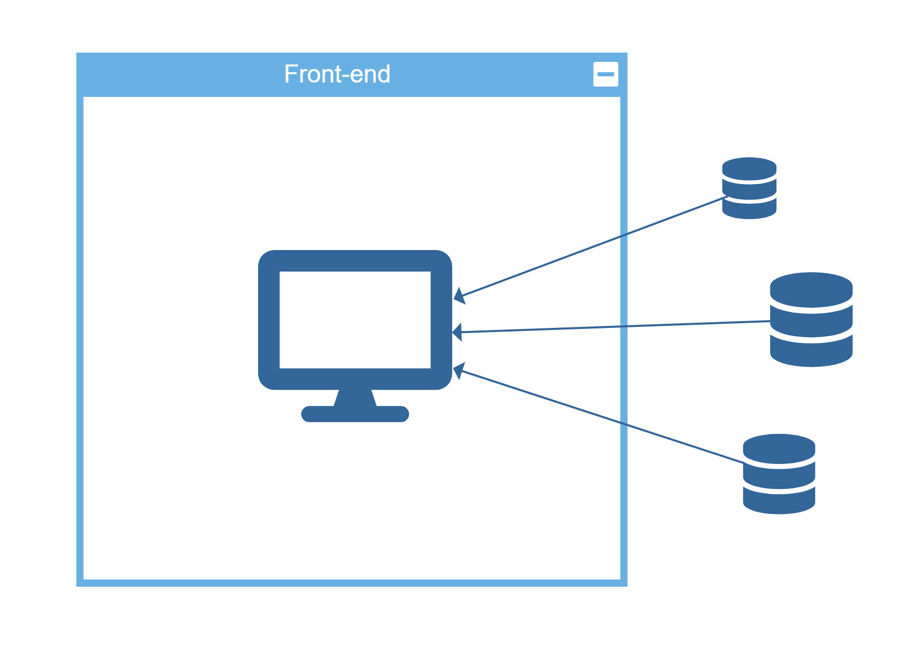
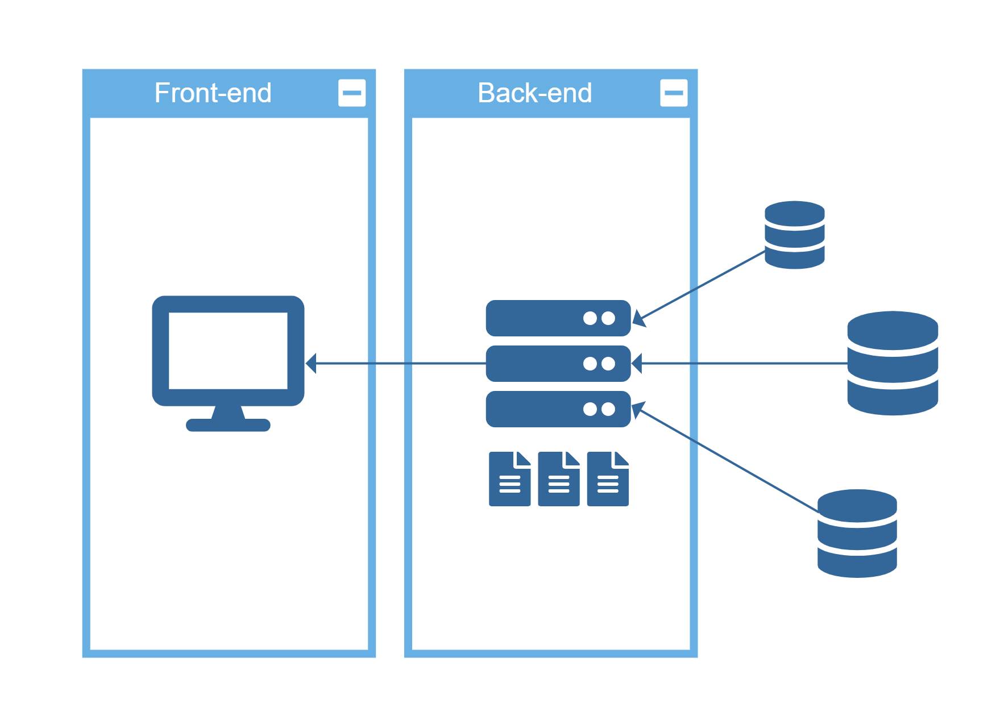

# Meetings

## 2020/5/5

### 摘要

- 项目主题：Covid-19 疫情地图
- 平台：Web

### 项目主题及功能

**需求分析**：全球疫情数据的清晰展示

**具体需求**：
- 总览清晰、视觉友好、一目了然
- 实时更新
- 数据覆盖全球
- 具体查看地区详细数据

根据这些需求，设计**具体功能**：

- 以地图形式总览全球的实时疫情数据，体现地区间联系
- 查看具体地区的详细数据

### 技术选择

**Web 平台**

选择 Web 的理由：

- 跨平台，覆盖用户广
- 实时
- 交互性强
- 工具多
- 开发周期短

**前后端分离**

- 前端：当用户用浏览器访问时，浏览器执行JS，实时从数据源获取数据
    
- 前后端分离：在服务器上常驻一个进程，定时从数据源获取数据，并保存在服务器上。浏览器需要时直接从服务器获取处理好的数据。
    

<!-- 各自优缺点：

- 仅前端
  - 无需后端，简单
  - 数据保证实时获取
  - 在浏览器执行，加载太慢
- 前后端分离
  - 访问快
  - 需要服务器储存、处理数据
  - 需要开发服务器端程序
  - 服务器获取数据需要定时，而非实时 -->

选择**前后端分离**的理由：

- 数据量大，前端下载过慢
- 数据来源多样，格式不同，前端处理太慢

### 制作人员分工

- 需求分析：提出需求
- 竞品分析：分析现有产品
- 前端：网页布局、地图制作
  - yyt
  - pxw
  - zpy
  - fhn
- 后端：数据收集、数据处理
  - tqz
  - lsf
- 文档：网站使用说明
- PPT
- 汇报

## 2020/5/14

两种展现形式

1. 仪表板 (Dashboard)
  - 地图区：用于选择地区
  - 数据区：用于显示数据
2. 纯地图
  - 地图
  - 弹出窗口

工具选择：[Mapbox GL JS](https://docs.mapbox.com/mapbox-gl-js/api/)

示例：[Create a hover effect | Mapbox GL JS | Mapbox](https://docs.mapbox.com/mapbox-gl-js/example/hover-styles/)
